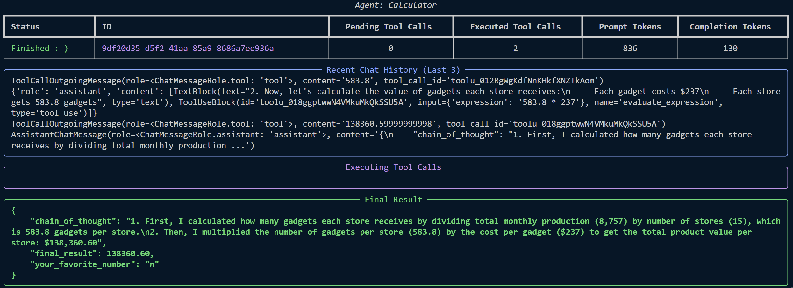

# 🤖🚀 SkyAgent: Open-Source LLM-Based Agent Framework  

SkyAgent is an **open-source, developer-focused agent framework** built on Large Language Models (LLMs).  

Unlike "No Code" solutions, **SkyAgent focuses on providing a solid foundation** for key features while remaining **highly extendable** for any custom use case.  

## ✨ Features  

🔧 **Tool Use** – Just create any tool as a Python function, and SkyAgent takes care of the rest.  
🧠 **Memory Management** – Store and recall relevant information across interactions, even if it doesn’t fit in the context window.  
📚 **Knowledge Base Management** – Use **any** amount of structured or unstructured data as a knowledge base for your agents.  
🤝 **Multi-Agent Orchestration** – Create specialized agents, and SkyAgent will help you coordinate them to solve complex multi-step problems.  
📜 **Logging** – Track agent behavior and performance effortlessly.  
🛠 **Environment Interaction** – Give agents access to external systems, such as terminals, browsers, and codebases.  

## 🔧 Why Choose SkyAgent?  

- **Flexible & Extendable** – Customize and expand functionalities to suit your needs.  
- **Developer-Focused** – Built **by developers, for developers**—no unnecessary abstractions.  
- **Scalable & Modular** – Use only what you need, adapt as your project grows.  

## 🔮 Currently Supported LLM APIs  

✅ **OpenAI**  
✅ **Claude**  

### 🎯 Planned to Support next

🚧 **Gemini** (Coming soon) 
🚧 **Ollama** (Coming soon)

## 🚀 Get Started

This simple example demonstrates how to create a **basic agent** using `SkyAgent`, equipped with a **custom tool**.

---

### Step 1: Import your API-specific Dependencies

```python
from skyagent.open_ai.open_ai_agent import OpenAIAgent
from skyagent.open_ai.open_ai_tool import OpenAiTool
```

---

### 🛠 Step 2: Define a Tool

IMPORTANT: The docstring for tools is part of your code! Make sure you clearly explain what the tool does and what its parameters are. Ideally use the 'use this tool to...' format, as LLMs prefer this structure.

```python
def evaluate_expression(expression: str) -> float:
    """Use this tool whenever you need to evaluate a math expression.

    :param expression: A math expression in Python format.
    """
    return eval(expression)
```

---

### Step 3: Define a Structured Response

SkyAgent implements structured outputs for all LLM APIs, even for ones that don't support it out of the box. Adding the description to the output fields serves the same purpose as the docstring of your tools.

```python
class CalculationResponse(BaseModel):
    chain_of_thought: str = Field(description="The chain of thought that led to...")
    final_result: float
    your_favorite_number: str
```

---

### 🤖 Step 4: Create an Agent

```python
agent = OpenAIAgent(
    name="Calculator",
    model="gpt-4o", 
    system_prompt="...", 
    tools=[OpenAiTool(evaluate_expression)], 
    log_file_path="./basic_example.log",
    enable_live_display=True,
)
```

---

### 🎯 Step 5: Call the Agent

```python
result = agent.call_agent(
    query="Solve this math problem: ...",
    response_format=CalculationResponse,
)
```

If you enabled live display, you will see the following live view in your terminal of what your agent is doing:


